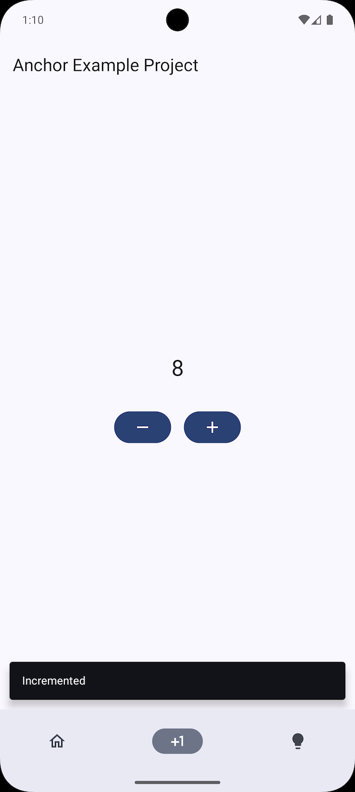

# Welcome to ⚓️ anchor

Anchor is simple and extensible state management architecture built on Kotlin's Context receivers
with Jetpack Compose integration.

!!! tip "Goal"
    **Focus on writing an amazing app and let Anchor handle the rest!**


## Installation

Follow the Github
Packages [guide](https://docs.github.com/en/packages/working-with-a-github-packages-registry/working-with-the-gradle-registry#using-a-published-package)
to use a published package from the github packages repository.

1. Generate a classic token with `read:packages` access with the help
   of [Github guide](https://docs.github.com/en/packages/working-with-a-github-packages-registry/working-with-the-gradle-registry#authenticating-to-github-packages)

2. Add the repository to your build.gradle.kts file

    ```kotlin
    repositories {
      maven {
        url = uri("https://maven.pkg.github.com/kioba/anchor")
        credentials {
          username = project.findProperty("gpr.user") as String? ?: System.getenv("USERNAME")
          password = project.findProperty("gpr.key") as String? ?: System.getenv("TOKEN")
        }
      }
    }
    ```

3. Add the package dependencies to your build.gradle.kts file

    ```kotlin
    implementation("dev.kioba:anchor:0.0.7")
    ```

## Counter example

Counter example to showcase the usage of Anchor architecture. The screen displays a count and the
ability to increment and decrement the count.

{ align=right }

```kotlin linenums="1" hl_lines="25 29"
// viewState to represent the state of screen
data class CounterState(
  val count: Int = 0,
) : ViewState

// type alias to easily reference our Scope without repeating the type arguments
typealias CounterAnchor = Anchor<EmptyEffect, CounterState>

// function to generate the Scope with the initial state
fun RememberAnchorScope.counterAnchor(): CounterAnchor =
  create(
    initialState = ::CounterState,
    effectScope = { EmptyEffect },
  )

// Provide the Anchor abilities with a captured receiver
fun CounterAnchor.increment() {
  // modify the view state by incrementing the state value
  reduce { copy(count = count.inc()) }
}

@Composable
fun CounterUi() {
  // Scope computations are remembered and retained across configuration changes
  RememberAnchor(RememberAnchorScope::counterAnchor) { state ->
    Button(
      // within a RememberAnchor actions can be executed
      // without the requirement to pass around the scope
      onClick = anchor<CounterAnchor> { increment() },
    ) { IncrementIcon() }
  }
}
```

### ViewModel

Storing Anchor within a ViewModel is not required manually. `RememberAnchor` takes care of handling the storage within a dedicated ViewModel.


## Configuration changes and process death

TBD

### ViewState

TBD

License
--------

    Copyright 2025 Karoly Somodi

    Licensed under the Apache License, Version 2.0 (the "License");
    you may not use this file except in compliance with the License.
    You may obtain a copy of the License at

       http://www.apache.org/licenses/LICENSE-2.0

    Unless required by applicable law or agreed to in writing, software
    distributed under the License is distributed on an "AS IS" BASIS,
    WITHOUT WARRANTIES OR CONDITIONS OF ANY KIND, either express or implied.
    See the License for the specific language governing permissions and
    limitations under the License.
