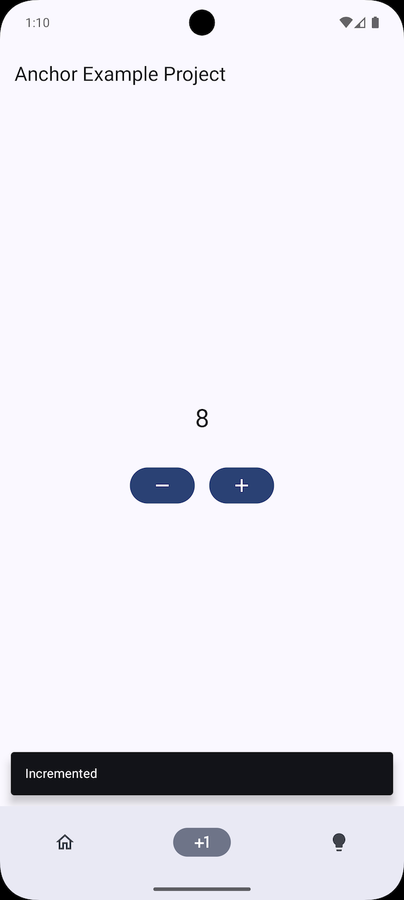

# Welcome to ⚓️ anchor

Anchor is a simple and extensible state management architecture built on Kotlin's Context receivers
with Jetpack Compose integration.

!!! tip "Goal"
    **Focus on writing an amazing app and let Anchor handle the rest!**


## Installation

Add the package dependencies to your `build.gradle.kts` file:

```kotlin
implementation("dev.kioba:anchor:0.0.8")
```

## Core Concepts

Anchor revolves around three main components:
- **ViewState**: Immutable representation of your UI state.
- **Anchor**: The engine that manages state updates (`reduce`) and side effects (`effect`).
- **Signals**: One-shot events (like navigation or alerts) that shouldn't be part of the persistent state.

## Counter example

{ align=right }

```kotlin linenums="1"
// 1. Define ViewState
data class CounterState(val count: Int = 0) : ViewState

// 2. Define Anchor type
typealias CounterAnchor = Anchor<EmptyEffect, CounterState>

// 3. Create factory
fun RememberAnchorScope.counterAnchor(): CounterAnchor =
  create(
    initialState = ::CounterState,
    effectScope = { EmptyEffect },
  )

// 4. Define Actions
fun CounterAnchor.increment() {
  reduce { copy(count = count.inc()) }
}

// 5. Build UI
@Composable
fun CounterUi() {
  RememberAnchor(RememberAnchorScope::counterAnchor) {
    // Optimized: Recomposes ONLY when count changes
    val count by collectState { it.count }

    Button(
      onClick = anchor(CounterAnchor::increment),
    ) {
        Text("Count is $count")
    }
  }
}
```

## One-Shot Signals

Signals are perfect for events that should only happen once, like showing a Toast or navigating.

```kotlin
// Define a signal
sealed interface CounterSignal : Signal {
    object ShowConfetti : CounterSignal
}

// Post it from your Anchor
fun CounterAnchor.celebrate() {
    post { CounterSignal.ShowConfetti }
}

// Handle it in Compose
@Composable
fun CounterUi() {
    RememberAnchor(RememberAnchorScope::counterAnchor) {
        HandleSignal<CounterSignal.ShowConfetti> {
            // This runs exactly once per emission
            showConfetti()
        }
    }
}
```

## Performance Optimization

Anchor provides a non-collecting version of `RememberAnchor` to maximize performance.

- **`RememberAnchor(::scope) { state -> ... }`**: Convenient but recomposes the whole block on every state update.
- **`RememberAnchor(::scope) { ... }`**: Optimized. Use `collectState { it.property }` to observe specific state changes.

## Threading and Lifecycle

- **State Updates**: Always happen on the Main dispatcher via `StateFlow`.
- **Side Effects**: `effect { ... }` blocks run on `Dispatchers.IO` by default.
- **Lifecycle**: `RememberAnchor` automatically manages a `ViewModel` internally, so your Anchor is retained across configuration changes and cleared when the UI is disposed.

License
--------

    Copyright 2025 Karoly Somodi

    Licensed under the Apache License, Version 2.0 (the "License");
    you may not use this file except in compliance with the License.
    You may obtain a copy of the License at

       http://www.apache.org/licenses/LICENSE-2.0

    Unless required by applicable law or agreed to in writing, software
    distributed under the License is distributed on an "AS IS" BASIS,
    WITHOUT WARRANTIES OR CONDITIONS OF ANY KIND, either express or implied.
    See the License for the specific language governing permissions and
    limitations under the License.
